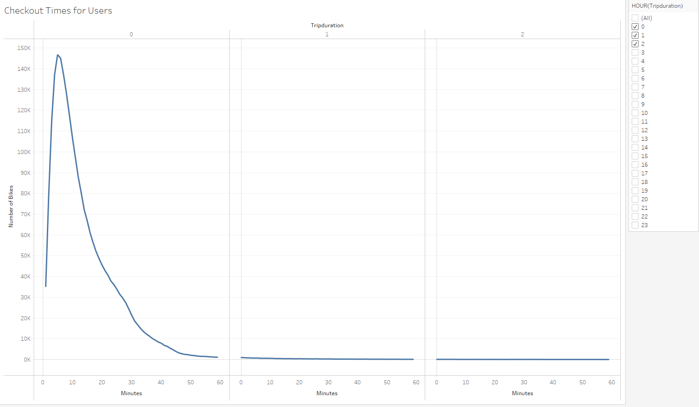
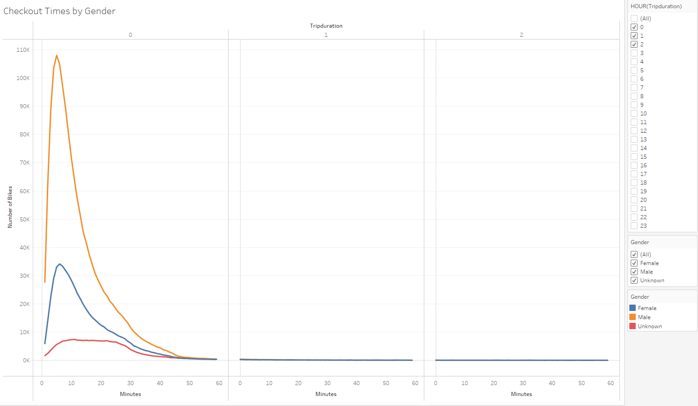
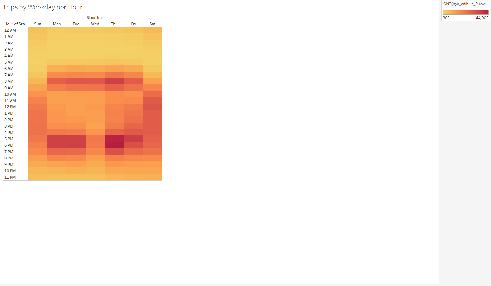
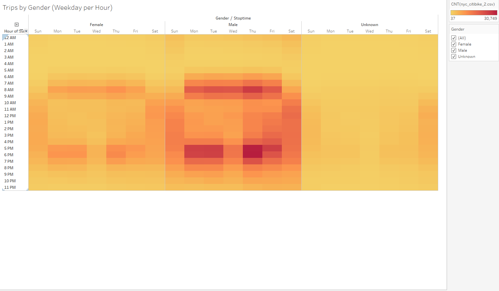
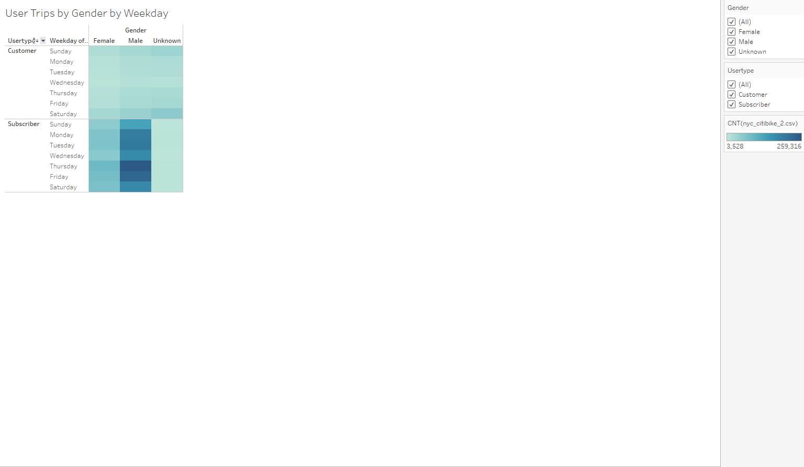

# Bikesharing

## Purpose

We need to gather more data in order to create a story that will convince investors that a bike-sharing program in Des Moines is a solid business proposal. To solidify the proposal, one of the key stakeholders would like to see a bike trip analysis.

## Results

### 1. Checkout Times for All Users
Riders typically like to bike between 2 and 20 minutes.

### 2. Checkout Times by Gender
Males are significantly higher users than others.

### 3. Trips Weekday per Hour
6-10 am and 5-8 PM are peak riding hours during the weekday and 5 am to 10 pm on the weekends.

### 4. Trips by Gender Weekday per Hour
Males are high users during the peak hours.

### 5. Trips by Gender and User Type Weekday per Hour 
Males subscribers are the highest users followed by female subscribers.

Also, here is the Story view of the Results:

[Link to Dashboard](https://public.tableau.com/app/profile/gonzalo.ampuero/viz/Module_Complete/Bikesharing?publish=yes)

## Summary
1. Bike Repairs for 1/3 of the Citibikes need to be done during non-peak hours around 1-5 am.
2. Male subscribers are the highest users and follow the traditional high use times of travel to and from work.
3. Target market should be males needing transportation to work and weekend activities and push for subscribing to the services.

